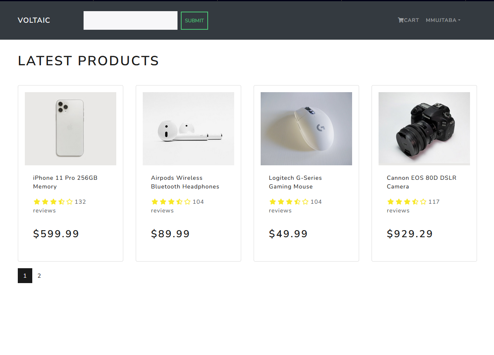
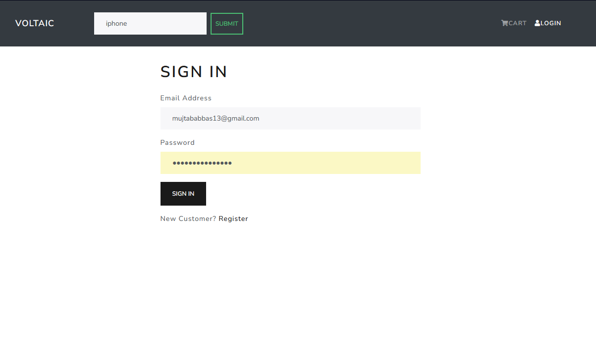
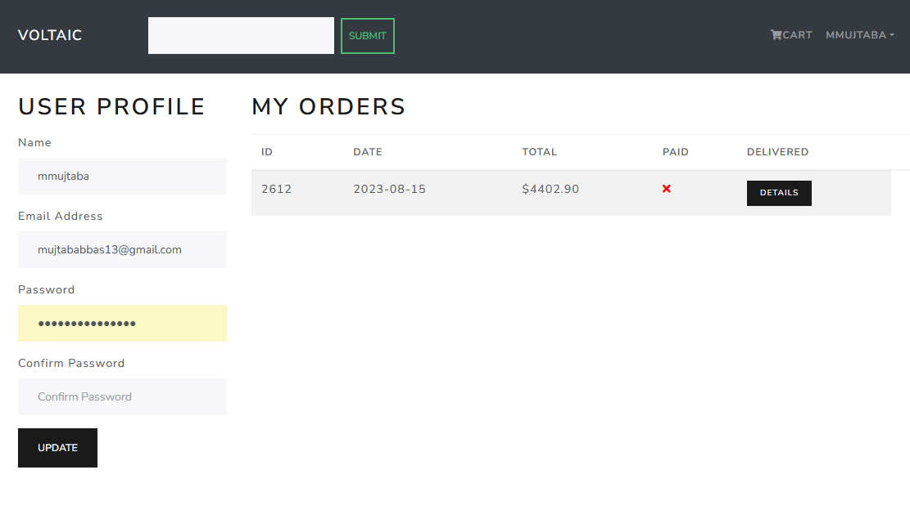
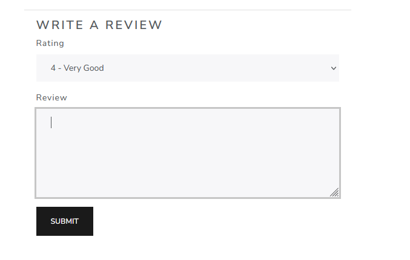
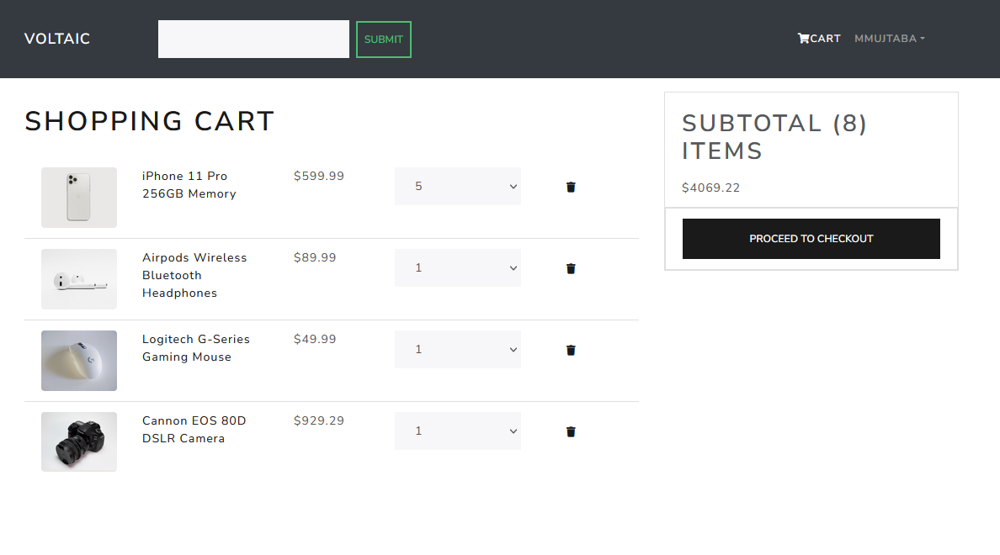
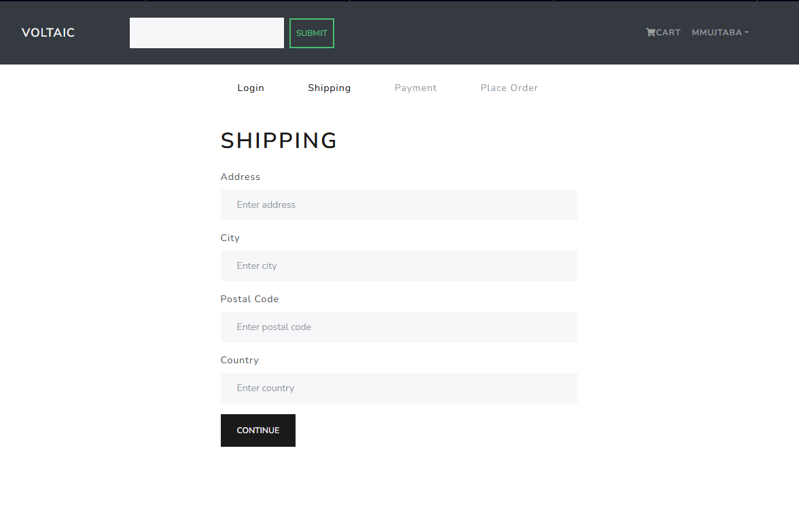
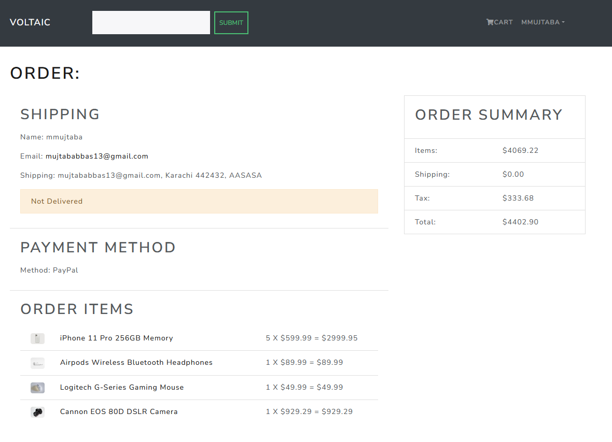

# Voltaic - Ecommerce Website With Django + React

# Features
* Full featured shopping cart
* Product reviews and ratings
* Top products carousel
* Product pagination
* Product search feature
* User profile with orders
* Admin product management
* Admin user management
* Admin Order details page
* Mark orders as delivered option
* Checkout process (shipping, payment method, etc)

# Download & Setup Instructions
* 1 - Clone project: git clone https://github.com/mujtaba-jpj/Voltaic
* 2 - cd Voltaic
* 3 - Create virtual environment: virtualenv myenv
* 4 - myenv\scripts\activate
* 5 - pip install -r requirements.txt
* 6 - python manage.py runserver

# Install react modules
* 1 - cd frontend
* 2 - npm install

# Tech Stack

* 1 - Django
* 2 - Postgres
* 3 - Django REST Framework
* 4 - React

# Home Page 
 

# User Registration
 

# User
 

# Product 
 

# Review Product
 

# Cart
 

# Order Details
 

# Checkout
 

 
